# Tafsula Use Case Diagram Documentation (with include and extend)

This document contains a detailed PlantUML use case diagram code describing how different actors interact with the Tafsula platform, starting from authentication and using include and extend relationships.

## Actors
- **Superadmin**: Has full administrative access.
- **HR Manager**: Manages startup team, views compatibility.
- **Employee**: Takes DISC test, views personal results and insights.

## Use Case Diagram Code

```plantuml
@startuml
top to bottom direction
skinparam packageStyle rectangle

actor "Superadmin" as Superadmin
actor "HR Manager" as HR
actor "Employee" as Employee

rectangle "Tafsula Platform" {

  usecase "Authenticate" as UC_Authenticate
  usecase "Register" as UC_Register
  usecase "Login" as UC_Login
  usecase "Logout" as UC_Logout

  usecase "Take DISC Personality Test" as UC_TakeTest
  usecase "Submit Test Answers" as UC_SubmitAnswers
  usecase "View Personal Results" as UC_ViewResults
  usecase "View AI-Powered Insights" as UC_ViewInsights
  usecase "View Team Compatibility" as UC_ViewCompatibility
  usecase "Manage Users" as UC_ManageUsers
  usecase "Manage Startups" as UC_ManageStartups
  usecase "Seed Initial Data" as UC_SeedData

  ' Authentication flow
  Superadmin --> UC_Login
  HR --> UC_Login
  Employee --> UC_Login

  UC_Login --> UC_Authenticate
  UC_Register --> UC_Authenticate
  UC_Logout --> UC_Authenticate

  ' Employee use cases
  Employee --> UC_Register
  Employee --> UC_TakeTest : <<include>> UC_Authenticate
  UC_TakeTest --> UC_SubmitAnswers
  UC_SubmitAnswers --> UC_ViewResults
  UC_SubmitAnswers --> UC_ViewInsights

  Employee --> UC_ViewResults : <<include>> UC_Authenticate
  Employee --> UC_ViewInsights : <<include>> UC_Authenticate

  ' HR use cases
  HR --> UC_ViewCompatibility : <<include>> UC_Authenticate
  HR --> UC_ViewResults : <<include>> UC_Authenticate
  HR --> UC_ViewInsights : <<include>> UC_Authenticate

  ' Superadmin use cases
  Superadmin --> UC_ManageUsers : <<include>> UC_Authenticate
  Superadmin --> UC_ManageStartups : <<include>> UC_Authenticate
  Superadmin --> UC_ViewCompatibility : <<include>> UC_Authenticate
  Superadmin --> UC_SeedData : <<include>> UC_Authenticate

  ' Extend relationships for optional or conditional flows
  UC_TakeTest .> UC_ViewResults : <<extend>>
  UC_TakeTest .> UC_ViewInsights : <<extend>>
  UC_ManageUsers .> UC_ManageStartups : <<extend>>

  note right of UC_ViewCompatibility
    Calculates team balance, strengths, weaknesses, and recommendations
  end note

  note right of UC_ViewInsights
    AI-generated personalized feedback based on DISC results
  end note

  note right of UC_ManageUsers
    Create, update, delete users and assign roles
  end note

  note right of UC_ManageStartups
    Create and manage startup entities
  end note

  note right of UC_SeedData
    Initialize database with default users, startups, questions, and sample results
  end note

}

@enduml
```

## Explanation

- All actors must authenticate (login/register) before accessing other features.
- Authentication includes login, registration, and logout.
- Employees take the DISC test, submit answers, and view their results and AI insights.
- HR Managers view team compatibility, employee results, and insights for their startup.
- Superadmins manage users, startups, view compatibility across startups, and seed initial data.
- Include relationships indicate mandatory prerequisite actions (e.g., authentication).
- Extend relationships indicate optional or conditional actions extending base use cases.

---

This use case diagram and documentation provide a clear and detailed overview of how actors interact with the Tafsula platform, starting from authentication and using include and extend relationships.
